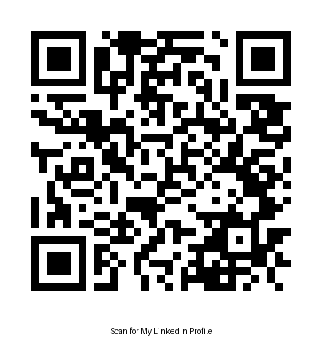

# QR Code Generator for Resume

This project generates a **QR code** that, when scanned, directs the user to your desired URL. The QR code can be customized with additional text or a logo and can open your LinkedIn profile, resume, or any other URL.




## Features:
- QR Code Generator: Create QR codes that point to URLs (e.g., your resume, LinkedIn).
- QR Code Scanner: Scan QR codes in real-time using your webcam and retrieve their data.
- Customizable QR Codes: You can add text below the QR code (e.g., "Scan for Resume") and adjust the image style.

## 📁 Project Structure

```
QR-Code-Generator-and-Scanner
├── myenv
├── Qr_code
│   ├── Qr_code_img
│   │   ├── my_qrcode.png
│   ├── Qr_code.py
│   ├── Qr_code_scanner.py
├── requirements.txt
├── README.md

```
## Installation:

### Install OpenCV and pyzbar:

1. pyzbar: For scanning QR codes. <br>
2. opencv-python: For working with the webcam to scan QR codes.

```bash
pip install pyzbar opencv-python
```

## Author

👤 **[Vetrivel Maheswaran](https://github.com/Vetrivel07)**

## Connect With Me 🌐

**[](https://www.linkedin.com/in/vetrivel-maheswaran/)**

**[](https://vetrivel07.github.io/vetrivel-maheswaran)**

<p align="center"><b>© Created by Vetrivel Maheswaran</b></p?
